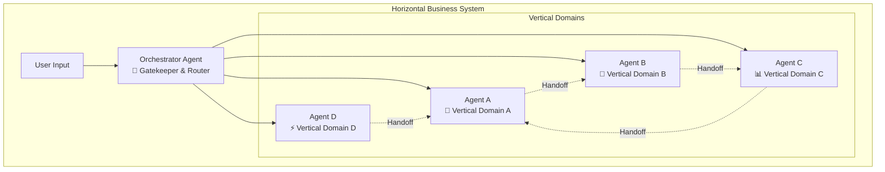
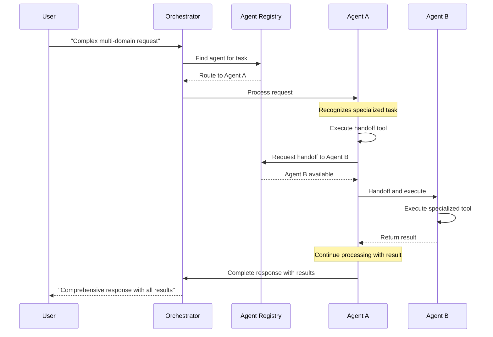
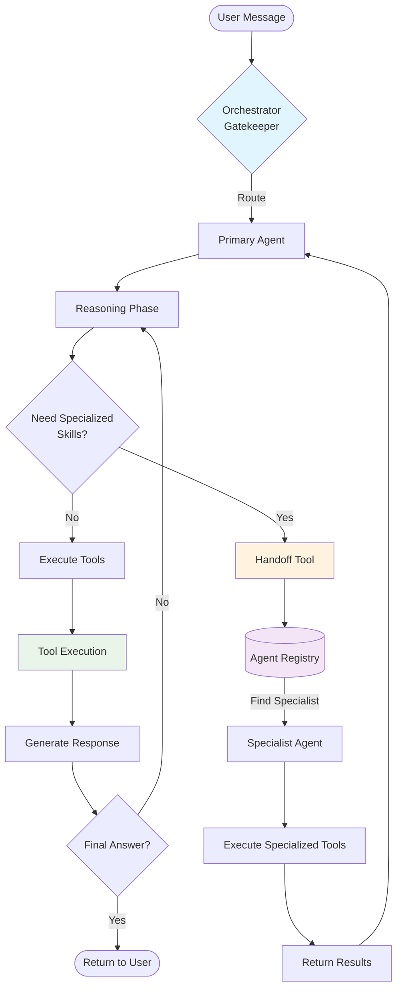
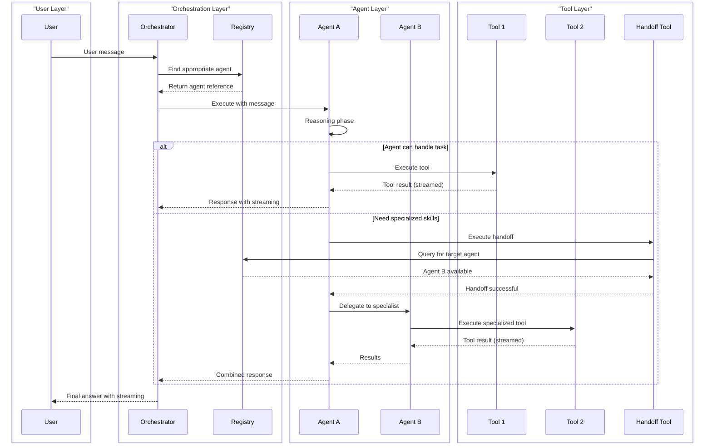
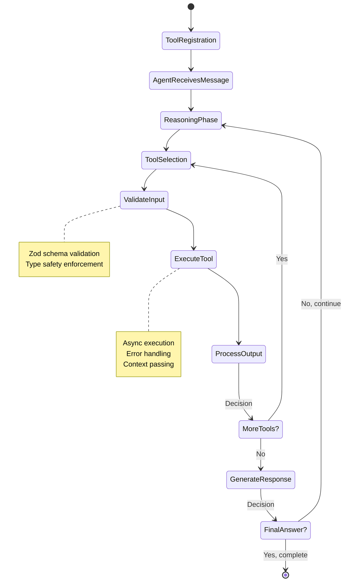

# @repo/ai-agents

A powerful TypeScript package for building scalable AI agent systems with horizontal orchestration and vertical specialization.

## 🌟 Overview

The `@repo/ai-agents` package provides a comprehensive framework for building AI-powered applications that can handle complex tasks through agent collaboration. It implements a **horizontal system architecture** where an orchestrator manages multiple specialized vertical agents, enabling seamless handoffs and capability sharing.

## 🏗️ Core Architecture

### Horizontal System Design

One business can be represented as a **horizontal system** using an **orchestrator agent** that manages multiple specialized verticals. Each vertical represents a specific domain with its own capabilities, tools, and expertise.



### Agent Registry & Handoff System

The system includes a centralized registry that enables agents to discover and communicate with each other through capability-based handoffs.



## 📋 Table of Contents

- [Installation](#installation)
- [Package Structure](#package-structure)
- [Quick Start](#quick-start)
- [Core Concepts](#core-concepts)
- [Architecture Deep Dive](#architecture-deep-dive)
- [API Reference](#api-reference)
- [Tool Development](#tool-development)
- [Best Practices](#best-practices)
- [Examples](#examples)

## 🚀 Installation

```bash
# Using pnpm (recommended)
pnpm add @repo/ai-agents

# Using npm
npm install @repo/ai-agents

# Using yarn
yarn add @repo/ai-agents
```

## 📁 Package Structure

The package is organized with a clean separation between contracts and implementations:

```
src/
├── contracts/           # Type definitions and interfaces
│   ├── agent.ts             # Agent-related types and interfaces
│   ├── handoff.ts           # Handoff-related types and schemas
│   ├── llm.ts               # LLM integration types and callbacks
│   ├── message.ts           # Message and metadata types
│   ├── orchestrator.ts      # Orchestrator context types
│   └── tool.ts              # Tool definitions and execution types
├── impl/               # Implementation classes
│   ├── agent.ts              # Agent class implementation
│   ├── agent-orchestrator.ts    # Orchestrator class implementation
│   ├── agent-registry.ts     # Registry class implementation
│   └── handoff-tool.ts       # Handoff tool implementation
├── utils/              # Utility functions
│   ├── format-date-time.ts   # Date/time formatting utilities
│   ├── format-xml.ts         # XML formatting utilities
│   └── json-parse.ts         # Safe JSON parsing utilities
└── index.ts           # Main package exports
```

### Design Principles

- **Contracts First**: All interfaces and types are defined in the `contracts` folder
- **Direct Imports**: Import directly from specific contract files (no index re-exports)
- **Clean Separation**: Implementation classes only depend on contracts, not other implementations
- **Type Safety**: Full TypeScript support with strict typing
- **Modular Design**: Each contract file focuses on a specific domain

## ⚡ Quick Start

### 1. Create a Basic Agent

```typescript
import { Agent } from '@repo/ai-agents';
import { z } from 'zod';

// Create an LLM adapter (example implementation)
const callLlm = async (input: string, onStreamingChunk?: StreamingCallback) => {
  // Your LLM integration here
  const response = await llmClient.generate(input);
  return { 
    content: response.text,
    usage: {
      model: "your-model",
      inputTokens: response.inputTokens,
      outputTokens: response.outputTokens,
      cost: response.cost
    }
  };
};

// Create a specialized agent
const domainAgent = new Agent(
  "You are a specialized agent for domain-specific tasks with expertise in your area.",
  callLlm,
  { 
    maxSteps: 10,
    timeZone: "America/New_York",
    locale: "en-US"
  }
);

// Register a tool
domainAgent.registerTool({
  name: "process_data",
  description: "Process domain-specific data",
  schema: z.object({
    input: z.string().describe("Data to process"),
    options: z.object({
      format: z.enum(["json", "text"]).default("json")
    }).optional()
  }),
  execute: async (input) => {
    // Tool implementation
    return { 
      processed: true, 
      result: `Processed: ${input.input}`,
      format: input.options?.format || "json"
    };
  }
});
```

### 2. Set up Orchestrator with Multiple Agents

```typescript
import { AgentOrchestrator } from '@repo/ai-agents';

// Create orchestrator with gatekeeper agent
const orchestrator = new AgentOrchestrator("agent-a", 15);

// Register agents with capabilities
orchestrator.registerAgent("agent-a", agentA, ["general", "coordination", "routing"]);
orchestrator.registerAgent("agent-b", agentB, ["data-processing", "analysis"]);
orchestrator.registerAgent("agent-c", agentC, ["specialized-tasks", "computation"]);

// Process user requests with streaming support
const messages = await orchestrator.run({
  message: {
    role: "user",
    content: "Complex request requiring multiple specialized capabilities"
  },
  onMessage: (msg) => console.log('Message:', msg),
  onStreamingChunk: (chunk) => process.stdout.write(chunk),
  onToolResult: (toolResult) => {
    console.log(`Tool ${toolResult.name} executed:`, toolResult.output);
  },
  context: { userId: "user123", sessionId: "session456" }
});
```

## 🧠 Core Concepts

### Agents

An **Agent** is a specialized AI assistant with:
- A system prompt defining its role and behavior
- A set of tools it can execute
- The ability to communicate with other agents
- Structured response formatting with reasoning

### Orchestrator

The **AgentOrchestrator** manages:
- Agent registration and discovery
- Request routing to appropriate agents
- Handoff coordination between agents
- Context preservation across handoffs

### Tools

**Tools** are functions that agents can execute:
- Defined with Zod schemas for type safety
- Async execution with context passing
- Error handling and validation
- Serializable inputs and outputs

### Agent Registry

The **AgentRegistry** provides:
- Centralized agent discovery
- Capability-based routing
- Singleton pattern for global access
- Agent metadata management

## 🏛️ Architecture Deep Dive

### System Flow



### Agent Communication Protocol



### Tool Execution Lifecycle



## 📚 API Reference

### Agent Class

```typescript
class Agent<C = unknown> implements AgentInterface<C> {
  constructor(
    systemPrompt: string,
    callLlm: CallLlm,
    options?: {
      maxSteps?: number;
      timeZone?: TimeZone;
      locale?: Locale;
    }
  )
  
  // Core methods
  registerTool<T extends z.ZodType>(tool: Tool<T, C>): void
  enableHandoff(): void
  disableHandoff(): void
  run(params: {
    message?: Message;
    history?: Message[];
    onMessage?: OnMessage;
    onStreamingChunk?: StreamingCallback;
    onToolResult?: ToolResultStreamingCallback;
    context?: C;
  }): Promise<Message[]>
  
  // Properties
  systemPrompt: string // getter/setter for dynamic system prompt updates
}
```

### AgentOrchestrator Class

```typescript
class AgentOrchestrator {
  constructor(gatekeeperAgentId: string, maxSteps?: number)
  
  // Agent management
  registerAgent(
    agentId: string, 
    agent: AgentInterface<{ currentVerticalId?: string }>, 
    capabilities?: string[]
  ): void
  
  // Execution
  run(params: {
    message: Message;
    history?: Message[];
    context?: OrchestratorContext;
    onMessage?: OnMessage;
    onStreamingChunk?: StreamingCallback;
    onToolResult?: ToolResultStreamingCallback;
    preferredAgentId?: string;
  }): Promise<Message[]>
}
```

### Tool Interface

```typescript
interface Tool<T extends z.ZodType = z.ZodType, C = unknown> {
  name: string
  description: string
  schema: T
  execute: (input: z.infer<T>, context?: C) => Promise<unknown>
}
```

### Message Types

```typescript
interface Message {
  id?: string // Optional unique identifier
  role: string
  content?: string
  metadata?: Metadata
  timestamp?: Date
}

interface Metadata {
  error?: {
    message: string
    prompt: string
    response: string
  }
  reasoning?: {
    thought?: string
    isFinalAnswer?: boolean
  }
  tool?: ToolMetadata
  usage?: TokenUsage
}

interface ToolMetadata {
  name: string
  input: SerializableValue | null
  output: SerializableValue
}

interface TokenUsage {
  model?: string
  inputTokens?: number
  outputTokens?: number
  cost?: number
}
```

### AgentRegistry Class

```typescript
class AgentRegistry {
  // Singleton pattern
  static getInstance(): AgentRegistry
  
  // Agent management
  registerAgent<C = unknown>(
    agentId: string,
    agent: AgentInterface<C>,
    capabilities?: string[]
  ): void
  
  getAgent(agentId: string): ExtendedAgentInterface | undefined
  getAllAgentIds(): string[]
}

interface ExtendedAgentInterface<C = unknown> extends AgentInterface<C> {
  _id: string
  _capabilities: string[]
}
```

### Callback Types

```typescript
type OnMessage = (message: Message) => void | Promise<void>

type StreamingCallback = (chunk: string) => void

type ToolResultStreamingCallback = (toolResult: {
  name: string
  input: SerializableValue | null
  output: SerializableValue
  timestamp: Date
}) => void
```

## 🔧 Tool Development

### Creating Custom Tools

```typescript
import { z } from 'zod';

// Define tool schema
const emailToolSchema = z.object({
  to: z.string().email(),
  subject: z.string(),
  body: z.string(),
  priority: z.enum(['low', 'normal', 'high']).default('normal')
});

// Create the tool
const emailTool = {
  name: "send_email",
  description: "Send an email to a recipient",
  schema: emailToolSchema,
  execute: async (input) => {
    try {
      // Implementation
      const result = await emailService.send(input);
      return {
        success: true,
        messageId: result.id,
        sentAt: new Date().toISOString()
      };
    } catch (error) {
      return {
        success: false,
        error: error.message
      };
    }
  }
};

// Register with agent
agent.registerTool(emailTool);
```

### Tool Best Practices

1. **Input Validation**: Always use Zod schemas for type safety
2. **Error Handling**: Return structured error responses
3. **Documentation**: Provide clear descriptions for LLM understanding
4. **Serialization**: Ensure inputs/outputs are JSON serializable
5. **Context Usage**: Leverage context for agent-specific data

### Advanced Tool Patterns

```typescript
// Context-aware tool
const contextualTool = {
  name: "user_preference",
  description: "Get user preferences based on context",
  schema: z.object({
    category: z.string()
  }),
  execute: async (input, context) => {
    // Access context-specific data
    const userId = context?.userId;
    const preferences = await getUserPreferences(userId, input.category);
    return preferences;
  }
};

// Conditional tool registration
if (environment === 'production') {
  agent.registerTool(productionOnlyTool);
}
```

## 🌊 Streaming & Real-time Features

### Streaming Responses

The system supports real-time streaming of both LLM responses and tool execution results:

```typescript
// Set up streaming handlers
await agent.run({
  message: userMessage,
  onStreamingChunk: (chunk) => {
    // Handle real-time LLM text streaming
    process.stdout.write(chunk);
    // Or send to client: websocket.send(chunk);
  },
  onToolResult: (toolResult) => {
    // Handle real-time tool execution results
    console.log(`Tool executed: ${toolResult.name}`);
    // Stream structured data: websocket.send(JSON.stringify(toolResult));
  },
  onMessage: (message) => {
    // Handle complete messages
    console.log('Complete message:', message);
  }
});
```

### Tool Result Streaming

Tool results are automatically streamed with structured metadata:

```typescript
// Tool result structure
interface ToolResult {
  name: string;                    // Tool name
  input: SerializableValue | null; // Input parameters
  output: SerializableValue;       // Execution result
  timestamp: Date;                 // When execution completed
}

// Example tool result
{
  "name": "data_processor",
  "input": { "query": "analyze sales data" },
  "output": { "total": 15000, "trend": "increasing" },
  "timestamp": "2024-01-01T12:00:00.000Z"
}
```

### Integration with Web APIs

```typescript
// Express.js streaming endpoint
app.post('/chat', async (req, res) => {
  res.setHeader('Content-Type', 'text/plain');
  res.setHeader('Transfer-Encoding', 'chunked');
  
  await orchestrator.run({
    message: { role: "user", content: req.body.message },
    onStreamingChunk: (chunk) => res.write(chunk),
    onToolResult: (toolResult) => {
      // Send tool results as structured data
      res.write(JSON.stringify({ isToolResult: true, ...toolResult }));
    }
  });
  
  res.end();
});
```

## 🔄 Agent Handoff System

### Overview

The handoff system enables agents to delegate tasks to other specialized agents seamlessly:

```typescript
// Agent automatically hands off tasks to another vertical
// This happens internally via the handoff tool
const agent = new Agent("You are a general agent", callLlm);
agent.enableHandoff(); // Enable handoff capabilities

// Register with orchestrator
orchestrator.registerAgent("general", agent, ["general", "coordination"]);
orchestrator.registerAgent("specialist", specialistAgent, ["specialized", "domain"]);
```

### Handoff Process

1. **Recognition**: Agent recognizes task requires specialized capabilities
2. **Tool Execution**: Agent executes `handoff` tool with target vertical ID
3. **Delegation**: Task is handed off to the target agent
4. **Execution**: Specialized tools are executed by the target agent
5. **Return**: Results are integrated back into the conversation

### Handoff Tool

The system includes a built-in handoff tool:

```typescript
// Built-in handoff tool schema
const handoffSchema = z.object({
  targetVerticalId: z.string().describe(
    "The ID of the vertical to handoff to. Must be a registered vertical in the registry."
  )
});

// Usage is automatic - agents use this tool when needed
// You don't need to register it manually
```

### Registry Management

The `AgentRegistry` singleton manages all agents and their capabilities:

```typescript
import { AgentRegistry } from '@repo/ai-agents';

const registry = AgentRegistry.getInstance();

// Agents are automatically registered via orchestrator
// Access registry information if needed
const allAgentIds = registry.getAllAgentIds();
const specificAgent = registry.getAgent("agent-id");
```

## 🎯 Best Practices

### Agent Design

1. **Single Responsibility**: Each agent should have a clear, focused purpose
2. **Capability Mapping**: Register agents with descriptive capabilities
3. **System Prompts**: Write specific, actionable system prompts
4. **Tool Organization**: Group related tools within specialized agents

### Orchestration Patterns

```typescript
// ✅ Good: Capability-based registration
orchestrator.registerAgent("domain-specialist", domainAgent, [
  "data-processing", "analysis", "reporting", "computation"
]);

// ✅ Good: Descriptive agent IDs
orchestrator.registerAgent("workflow-coordinator", coordinatorAgent, [
  "orchestration", "routing", "coordination", "management"
]);

// ❌ Avoid: Generic capabilities
orchestrator.registerAgent("agent1", someAgent, ["general"]);
```

### Error Handling

```typescript
// Implement robust error handling
const safeAgent = new Agent(systemPrompt, async (input) => {
  try {
    return await llmCall(input);
  } catch (error) {
    console.error('LLM call failed:', error);
    return {
      content: "I'm experiencing technical difficulties. Please try again.",
      usage: { inputTokens: 0, outputTokens: 0, cost: 0 }
    };
  }
});
```

## 🧪 Examples

### Example 1: Multi-Domain Service System

```typescript
import { AgentOrchestrator, Agent } from '@repo/ai-agents';

// Create specialized agents
const primaryAgent = new Agent(
  "You are the primary coordinator that handles general inquiries and routes complex requests.",
  callLlm
);

const domainAgentA = new Agent(
  "You specialize in domain A operations with expertise in category A tasks.",
  callLlm
);

const domainAgentB = new Agent(
  "You specialize in domain B operations with expertise in category B tasks.",
  callLlm
);

// Set up orchestrator
const serviceOrchestrator = new AgentOrchestrator("primary-agent");

serviceOrchestrator.registerAgent("primary-agent", primaryAgent, [
  "general", "coordination", "routing", "basic-queries"
]);

serviceOrchestrator.registerAgent("domain-a", domainAgentA, [
  "category-a", "specialized-a", "analysis-a", "processing-a"
]);

serviceOrchestrator.registerAgent("domain-b", domainAgentB, [
  "category-b", "specialized-b", "computation-b", "validation-b"
]);

// Handle user request with streaming
const messages = await serviceOrchestrator.run({
  message: {
    role: "user",
    content: "I need help with a complex task that requires specialized processing"
  },
  onStreamingChunk: (chunk) => process.stdout.write(chunk),
  onToolResult: (result) => console.log('Tool executed:', result.name)
});
```

### Example 2: Data Processing Platform

```typescript
// Data ingestion agent
const ingestionAgent = new Agent(
  "You handle data ingestion, validation, and initial processing workflows.",
  callLlm
);

ingestionAgent.registerTool({
  name: "process_dataset",
  description: "Process and validate incoming datasets",
  schema: z.object({
    source: z.string(),
    format: z.enum(["csv", "json", "xml"]),
    validationRules: z.object({
      required: z.array(z.string()).optional(),
      types: z.record(z.string()).optional()
    }).optional()
  }),
  execute: async (input) => {
    return await dataService.process(input);
  }
});

// Analytics agent  
const analyticsAgent = new Agent(
  "You perform data analysis, generate insights, and create reports.",
  callLlm
);

analyticsAgent.registerTool({
  name: "analyze_data",
  description: "Perform statistical analysis on processed data",
  schema: z.object({
    datasetId: z.string(),
    analysisType: z.enum(["descriptive", "predictive", "diagnostic"]),
    parameters: z.object({
      timeframe: z.string().optional(),
      groupBy: z.array(z.string()).optional()
    }).optional()
  }),
  execute: async (input) => {
    return await analyticsService.analyze(input);
  }
});

// Set up data platform orchestrator
const dataOrchestrator = new AgentOrchestrator("ingestion");
dataOrchestrator.registerAgent("ingestion", ingestionAgent, ["data-processing", "validation", "import"]);
dataOrchestrator.registerAgent("analytics", analyticsAgent, ["analysis", "reporting", "insights"]);
```

### Example 3: Workflow Management System

```typescript
const coordinatorAgent = new Agent(
  "You coordinate workflows, manage task dependencies, and oversee process execution.",
  callLlm
);

const processingAgent = new Agent(
  "You execute data transformations, apply business logic, and handle computational tasks.",
  callLlm
);

const validationAgent = new Agent(
  "You validate results, ensure quality standards, and perform compliance checks.",
  callLlm
);

// Coordination tools
coordinatorAgent.registerTool({
  name: "create_workflow",
  description: "Create and configure a new workflow",
  schema: z.object({
    name: z.string(),
    steps: z.array(z.object({
      id: z.string(),
      type: z.enum(['processing', 'validation', 'notification']),
      dependencies: z.array(z.string()).optional()
    })),
    priority: z.enum(['low', 'medium', 'high']).default('medium')
  }),
  execute: async (input) => {
    return await workflowService.create(input);
  }
});

// Processing tools  
processingAgent.registerTool({
  name: "execute_transformation",
  description: "Execute data transformation operations",
  schema: z.object({
    inputData: z.any(),
    transformationType: z.enum(['filter', 'aggregate', 'format']),
    parameters: z.record(z.any()).optional()
  }),
  execute: async (input) => {
    return await processingService.transform(input);
  }
});

// Validation tools
validationAgent.registerTool({
  name: "validate_output",
  description: "Validate processing results against quality criteria",
  schema: z.object({
    data: z.any(),
    criteria: z.object({
      completeness: z.boolean().default(true),
      accuracy: z.number().min(0).max(1).default(0.95),
      customRules: z.array(z.string()).optional()
    })
  }),
  execute: async (input) => {
    return await validationService.validate(input);
  }
});
```

## 🔄 Advanced Usage

### Custom Context Types

```typescript
interface MyAppContext {
  userId: string;
  organizationId: string;
  permissions: string[];
  sessionData: Record<string, unknown>;
}

const contextAwareAgent = new Agent<MyAppContext>(
  "You are a context-aware assistant.",
  callLlm
);

contextAwareAgent.registerTool({
  name: "get_user_data",
  description: "Retrieve user-specific data",
  schema: z.object({
    dataType: z.string()
  }),
  execute: async (input, context) => {
    // Access typed context
    const userId = context?.userId;
    const permissions = context?.permissions || [];
    
    if (!permissions.includes('read:user-data')) {
      throw new Error('Insufficient permissions');
    }
    
    return await getUserData(userId, input.dataType);
  }
});
```

### Streaming Responses

```typescript
const streamingAgent = new Agent(systemPrompt, callLlm);

await streamingAgent.run({
  message: { role: "user", content: "Calculate 25 * 4 and tell me a story" },
  onStreamingChunk: (chunk) => {
    // Handle real-time LLM text streaming
    process.stdout.write(chunk);
  },
  onToolResult: (toolResult) => {
    // Handle real-time tool execution results
    console.log(`Tool executed: ${toolResult.name}`, toolResult.output);
  },
  onMessage: (message) => {
    // Handle complete messages
    console.log('Complete message:', message);
  }
});
```

### Dynamic Agent Registration

```typescript
class DynamicOrchestrator extends AgentOrchestrator {
  async registerAgentFromConfig(config: AgentConfig) {
    const agent = new Agent(config.systemPrompt, callLlm);
    
    // Register tools from configuration
    for (const toolConfig of config.tools) {
      const tool = await this.createToolFromConfig(toolConfig);
      agent.registerTool(tool);
    }
    
    this.registerAgent(config.id, agent, config.capabilities);
  }
  
  private async createToolFromConfig(config: ToolConfig) {
    // Dynamic tool creation logic
    return {
      name: config.name,
      description: config.description,
      schema: z.object(config.schema),
      execute: async (input) => {
        return await this.executeTool(config.implementation, input);
      }
    };
  }
}
```

## 🚀 Integration Examples

### Express.js API

```typescript
import express from 'express';
import { AgentOrchestrator } from '@repo/ai-agents';

const app = express();
const orchestrator = new AgentOrchestrator("assistant");

app.post('/chat', async (req, res) => {
  const { message } = req.body;
  
  // Set up streaming
  res.setHeader('Content-Type', 'text/plain');
  res.setHeader('Transfer-Encoding', 'chunked');
  
  await orchestrator.run({
    message: { role: "user", content: message },
    onStreamingChunk: (chunk) => res.write(chunk),
    onToolResult: (toolResult) => {
      // Stream tool results as JSON with isToolResult flag
      res.write(JSON.stringify({ isToolResult: true, ...toolResult }));
    },
    onMessage: (msg) => console.log('Message processed:', msg)
  });
  
  res.end();
});
```

### React Hook

```typescript
import { useCallback, useState } from 'react';

export function useAgentChat() {
  const [messages, setMessages] = useState([]);
  const [isLoading, setIsLoading] = useState(false);
  
  const sendMessage = useCallback(async (content: string) => {
    setIsLoading(true);
    
    try {
      const response = await fetch('/api/chat', {
        method: 'POST',
        headers: { 'Content-Type': 'application/json' },
        body: JSON.stringify({ message: content })
      });
      
      // Handle streaming response
      const reader = response.body?.getReader();
      // ... streaming logic
      
    } finally {
      setIsLoading(false);
    }
  }, []);
  
  return { messages, sendMessage, isLoading };
}
```

## 🛠️ Utilities

The package includes several utility functions for common tasks:

### Date/Time Formatting
```typescript
import { formatDateTime } from '@repo/ai-agents';

const formatted = formatDateTime({
  date: new Date(),
  timeZone: 'America/New_York',
  locale: 'en-US'
});
// Returns: { dayOfWeek: 'Monday', date: 'Dec 25, 2023', time: '2:30 PM' }
```

### XML Formatting
```typescript
import { formatXml } from '@repo/ai-agents';

const xml = formatXml(`
  <root>
    <item>value</item>
  </root>
`);
// Returns properly formatted XML string
```

### Safe JSON Parsing
```typescript
import { jsonParse } from '@repo/ai-agents';

const result = jsonParse('{"key": "value"}');
// Returns parsed object or null if invalid JSON
```

## 🔍 Debugging & Monitoring

### Debug Mode

```typescript
// Enable debug logging
process.env.DEBUG = 'ai-agents:*';

const agent = new Agent(systemPrompt, callLlm);
// Will log detailed execution information
```

### Custom Monitoring

```typescript
const monitoredOrchestrator = new AgentOrchestrator("assistant");

await monitoredOrchestrator.run({
  message: userMessage,
  onMessage: (message) => {
    // Custom monitoring logic
    analytics.track('agent_message', {
      role: message.role,
      hasContent: !!message.content,
      tokenUsage: message.metadata?.usage,
      timestamp: message.timestamp
    });
  }
});
```

## 📈 Performance Considerations

1. **Tool Execution**: Keep tool execution fast and efficient
2. **Context Size**: Manage context size to avoid token limits
3. **Caching**: Implement caching for frequently accessed data
4. **Parallel Execution**: Use Promise.all for independent operations
5. **Memory Management**: Clean up resources in long-running processes

## 🤝 Contributing

Contributions are welcome! Please read our contributing guidelines and submit pull requests for any improvements.

## 📄 License

This package is part of the ai-agents monorepo and follows the same licensing terms.

---

## 🎓 Key Takeaways

The `@repo/ai-agents` package enables you to build sophisticated AI systems by:

1. **Horizontal Architecture**: Using an orchestrator to manage multiple specialized agents
2. **Vertical Specialization**: Creating domain-specific agents with focused capabilities  
3. **Seamless Handoffs**: Enabling agents to delegate tasks to other agents automatically
4. **Type Safety**: Leveraging TypeScript and Zod for robust type checking
5. **Tool Integration**: Building extensible systems with custom tools and capabilities
6. **Scalable Design**: Supporting complex multi-agent workflows and business processes

This architecture allows you to build sophisticated AI systems that can handle complex, multi-domain tasks through intelligent agent coordination, real-time streaming capabilities, and seamless skill sharing between specialized verticals while maintaining clean separation of concerns and easy extensibility.
