# @repo/ai-agents

A powerful TypeScript package for building scalable AI agent systems with horizontal orchestration and vertical specialization.

## 🌟 Overview

The `@repo/ai-agents` package provides a comprehensive framework for building AI-powered applications that can handle complex tasks through agent collaboration. It implements a **horizontal system architecture** where an orchestrator manages multiple specialized vertical agents, enabling seamless handoffs and capability sharing.

## 🏗️ Core Architecture

### Horizontal System Design

One business can be represented as a **horizontal system** using an **orchestrator agent** that manages multiple specialized verticals. Each vertical represents a specific domain with its own capabilities, tools, and expertise.

```mermaid
graph TB
    subgraph "Horizontal Business System"
        O[Orchestrator Agent<br/>🎯 Gatekeeper & Router]
        
        subgraph "Vertical Domains"
            A1[Assistant Agent<br/>💬 General Tasks]
            A2[Calculator Agent<br/>🔢 Math Operations]
            A3[Weather Agent<br/>🌤️ Weather Data]
            A4[Custom Agent<br/>⚡ Domain Specific]
        end
        
        U[User Input] --> O
        O --> A1
        O --> A2  
        O --> A3
        O --> A4
        
        A1 -.->|Handoff| A2
        A2 -.->|Handoff| A3
        A3 -.->|Handoff| A1
        A4 -.->|Handoff| A1
    end
```



### Agent Registry & Handoff System

The system includes a centralized registry that enables agents to discover and communicate with each other through capability-based handoffs.


## 📋 Table of Contents

- [Installation](#installation)
- [Package Structure](#package-structure)
- [Quick Start](#quick-start)
- [Core Concepts](#core-concepts)
- [Architecture Deep Dive](#architecture-deep-dive)
- [API Reference](#api-reference)
- [Tool Development](#tool-development)
- [Best Practices](#best-practices)
- [Examples](#examples)

## 🚀 Installation

```bash
# Using pnpm (recommended)
pnpm add @repo/ai-agents

# Using npm
npm install @repo/ai-agents

# Using yarn
yarn add @repo/ai-agents
```

## 📁 Package Structure

The package is organized with a clean separation between contracts and implementations:

```
src/
├── contracts/           # Type definitions and interfaces
│   ├── agent.ts             # Agent-related types and interfaces
│   ├── orchestrator.ts       # Orchestrator-related types
│   └── handoff.ts           # Handoff-related types and schemas
├── impl/               # Implementation classes
│   ├── agent.ts              # Agent class implementation
│   ├── agent-orchestrator.ts    # Orchestrator class implementation
│   ├── agent-registry.ts     # Registry class implementation
│   └── handoff-tool.ts       # Handoff tool implementation
├── utils/              # Utility functions
│   ├── format-date-time.ts   # Date/time formatting utilities
│   ├── format-xml.ts         # XML formatting utilities
│   └── json-parse.ts         # Safe JSON parsing utilities
└── index.ts           # Main package exports
```

### Design Principles

- **Contracts First**: All interfaces and types are defined in the `contracts` folder
- **Direct Imports**: Import directly from specific contract files (no index re-exports)
- **Clean Separation**: Implementation classes only depend on contracts, not other implementations
- **Type Safety**: Full TypeScript support with strict typing
- **Modular Design**: Each contract file focuses on a specific domain

## ⚡ Quick Start

### 1. Create a Basic Agent

```typescript
import { Agent } from '@repo/ai-agents';
import { z } from 'zod';

// Create an LLM adapter (example with Gemini)
const callLlm = async (input: string) => {
  // Your LLM integration here
  const response = await geminiClient.generate(input);
  return { content: response.text };
};

// Create a specialized agent
const weatherAgent = new Agent(
  "You are a weather specialist that provides accurate weather information.",
  callLlm,
  { maxSteps: 10 }
);

// Register a tool
weatherAgent.registerTool({
  name: "get_weather",
  description: "Get current weather for a location",
  schema: z.object({
    location: z.string().describe("City name or coordinates")
  }),
  execute: async (input) => {
    // Tool implementation
    return { temperature: "22°C", condition: "Sunny" };
  }
});
```

### 2. Set up Orchestrator with Multiple Agents

```typescript
import { AgentOrchestrator } from '@repo/ai-agents';

// Create orchestrator with gatekeeper
const orchestrator = new AgentOrchestrator("assistant-agent");

// Register agents with capabilities
orchestrator.registerAgent("assistant-agent", assistantAgent, ["general", "help"]);
orchestrator.registerAgent("weather-agent", weatherAgent, ["weather", "climate"]);
orchestrator.registerAgent("calculator-agent", calculatorAgent, ["math", "calculation"]);

// Process user requests
const response = await orchestrator.run({
  message: {
    role: "user",
    content: "What's 25 * 4 and what's the weather in Paris?"
  },
  onMessage: (msg) => console.log(msg),
  onStreamingChunk: (chunk) => process.stdout.write(chunk)
});
```

## 🧠 Core Concepts

### Agents

An **Agent** is a specialized AI assistant with:
- A system prompt defining its role and behavior
- A set of tools it can execute
- The ability to communicate with other agents
- Structured response formatting with reasoning

### Orchestrator

The **AgentOrchestrator** manages:
- Agent registration and discovery
- Request routing to appropriate agents
- Handoff coordination between agents
- Context preservation across handoffs

### Tools

**Tools** are functions that agents can execute:
- Defined with Zod schemas for type safety
- Async execution with context passing
- Error handling and validation
- Serializable inputs and outputs

### Agent Registry

The **AgentRegistry** provides:
- Centralized agent discovery
- Capability-based routing
- Singleton pattern for global access
- Agent metadata management

## 🏛️ Architecture Deep Dive

### System Flow


### Agent Communication Protocol


### Tool Execution Lifecycle


## 📚 API Reference

### Agent Class

```typescript
class Agent<C = unknown> implements AgentInterface<C> {
  constructor(
    systemPrompt: string,
    callLlm: CallLlm,
    options?: {
      maxSteps?: number;
      timeZone?: TimeZone;
      locale?: Locale;
    }
  )
  
  // Core methods
  registerTool<T extends z.ZodType>(tool: Tool<T, C>): void
  enableHandoff(): void
  disableHandoff(): void
  run(params: RunParams): Promise<Message[]>
  
  // Properties
  systemPrompt: string
}
```

### AgentOrchestrator Class

```typescript
class AgentOrchestrator {
  constructor(gatekeeperAgentId: string, maxSteps?: number)
  
  // Agent management
  registerAgent(
    agentId: string, 
    agent: AgentInterface, 
    capabilities?: string[]
  ): void
  
  // Execution
  run(params: OrchestratorRunParams): Promise<Message[]>
}
```

### Tool Interface

```typescript
interface Tool<T extends z.ZodType = z.ZodType, C = unknown> {
  name: string
  description: string
  schema: T
  execute: (input: z.infer<T>, context?: C) => Promise<unknown>
}
```

### Message Types

```typescript
interface Message {
  role: string
  content?: string
  metadata?: Metadata
  timestamp?: Date
}

interface Metadata {
  error?: ErrorInfo
  reasoning?: ReasoningInfo
  tool?: ToolMetadata
  usage?: TokenUsage
}
```

## 🔧 Tool Development

### Creating Custom Tools

```typescript
import { z } from 'zod';

// Define tool schema
const emailToolSchema = z.object({
  to: z.string().email(),
  subject: z.string(),
  body: z.string(),
  priority: z.enum(['low', 'normal', 'high']).default('normal')
});

// Create the tool
const emailTool = {
  name: "send_email",
  description: "Send an email to a recipient",
  schema: emailToolSchema,
  execute: async (input) => {
    try {
      // Implementation
      const result = await emailService.send(input);
      return {
        success: true,
        messageId: result.id,
        sentAt: new Date().toISOString()
      };
    } catch (error) {
      return {
        success: false,
        error: error.message
      };
    }
  }
};

// Register with agent
agent.registerTool(emailTool);
```

### Tool Best Practices

1. **Input Validation**: Always use Zod schemas for type safety
2. **Error Handling**: Return structured error responses
3. **Documentation**: Provide clear descriptions for LLM understanding
4. **Serialization**: Ensure inputs/outputs are JSON serializable
5. **Context Usage**: Leverage context for agent-specific data

### Advanced Tool Patterns

```typescript
// Context-aware tool
const contextualTool = {
  name: "user_preference",
  description: "Get user preferences based on context",
  schema: z.object({
    category: z.string()
  }),
  execute: async (input, context) => {
    // Access context-specific data
    const userId = context?.userId;
    const preferences = await getUserPreferences(userId, input.category);
    return preferences;
  }
};

// Conditional tool registration
if (environment === 'production') {
  agent.registerTool(productionOnlyTool);
}
```

## 🎯 Best Practices

### Agent Design

1. **Single Responsibility**: Each agent should have a clear, focused purpose
2. **Capability Mapping**: Register agents with descriptive capabilities
3. **System Prompts**: Write specific, actionable system prompts
4. **Tool Organization**: Group related tools within specialized agents

### Orchestration Patterns

```typescript
// ✅ Good: Capability-based registration
orchestrator.registerAgent("data-agent", dataAgent, [
  "database", "analytics", "reporting", "sql"
]);

// ✅ Good: Descriptive agent IDs
orchestrator.registerAgent("customer-support", supportAgent, [
  "tickets", "escalation", "knowledge-base"
]);

// ❌ Avoid: Generic capabilities
orchestrator.registerAgent("agent1", someAgent, ["general"]);
```

### Error Handling

```typescript
// Implement robust error handling
const safeAgent = new Agent(systemPrompt, async (input) => {
  try {
    return await llmCall(input);
  } catch (error) {
    console.error('LLM call failed:', error);
    return {
      content: "I'm experiencing technical difficulties. Please try again.",
      usage: { inputTokens: 0, outputTokens: 0, cost: 0 }
    };
  }
});
```

## 🧪 Examples

### Example 1: Multi-Domain Business Assistant

```typescript
import { AgentOrchestrator, Agent } from '@repo/ai-agents';

// Create specialized agents
const customerServiceAgent = new Agent(
  "You handle customer inquiries, complaints, and support requests with empathy and efficiency.",
  callLlm
);

const salesAgent = new Agent(
  "You help with product information, pricing, and sales processes.",
  callLlm
);

const technicalAgent = new Agent(
  "You provide technical support and troubleshooting assistance.",
  callLlm
);

// Set up orchestrator
const businessOrchestrator = new AgentOrchestrator("customer-service");

businessOrchestrator.registerAgent("customer-service", customerServiceAgent, [
  "support", "complaints", "inquiries", "refunds"
]);

businessOrchestrator.registerAgent("sales", salesAgent, [
  "products", "pricing", "quotes", "orders"
]);

businessOrchestrator.registerAgent("technical", technicalAgent, [
  "troubleshooting", "setup", "configuration", "bugs"
]);

// Handle customer request
const response = await businessOrchestrator.run({
  message: {
    role: "user",
    content: "I need help setting up the product I just bought"
  }
});
```

### Example 2: E-commerce Platform

```typescript
// Product catalog agent
const catalogAgent = new Agent(
  "You manage product information, inventory, and catalog operations.",
  callLlm
);

catalogAgent.registerTool({
  name: "search_products",
  description: "Search products by criteria",
  schema: z.object({
    query: z.string(),
    category: z.string().optional(),
    priceRange: z.object({
      min: z.number(),
      max: z.number()
    }).optional()
  }),
  execute: async (input) => {
    return await productService.search(input);
  }
});

// Order management agent  
const orderAgent = new Agent(
  "You handle order processing, tracking, and fulfillment.",
  callLlm
);

orderAgent.registerTool({
  name: "create_order",
  description: "Create a new order",
  schema: z.object({
    customerId: z.string(),
    items: z.array(z.object({
      productId: z.string(),
      quantity: z.number()
    }))
  }),
  execute: async (input) => {
    return await orderService.create(input);
  }
});

// Set up e-commerce orchestrator
const ecommerceOrchestrator = new AgentOrchestrator("catalog");
ecommerceOrchestrator.registerAgent("catalog", catalogAgent, ["products", "search", "inventory"]);
ecommerceOrchestrator.registerAgent("orders", orderAgent, ["ordering", "checkout", "fulfillment"]);
```

### Example 3: Content Management System

```typescript
const contentAgent = new Agent(
  "You create, edit, and manage content across various formats and platforms.",
  callLlm
);

const seoAgent = new Agent(
  "You optimize content for search engines and analyze SEO metrics.",
  callLlm
);

const publishingAgent = new Agent(
  "You handle content publishing, scheduling, and distribution.",
  callLlm
);

// Content tools
contentAgent.registerTool({
  name: "generate_content",
  description: "Generate content based on parameters",
  schema: z.object({
    type: z.enum(['blog', 'social', 'email']),
    topic: z.string(),
    tone: z.enum(['professional', 'casual', 'friendly']),
    length: z.number()
  }),
  execute: async (input) => {
    return await contentService.generate(input);
  }
});

// SEO tools  
seoAgent.registerTool({
  name: "analyze_seo",
  description: "Analyze content for SEO optimization",
  schema: z.object({
    content: z.string(),
    targetKeywords: z.array(z.string())
  }),
  execute: async (input) => {
    return await seoService.analyze(input);
  }
});
```

## 🔄 Advanced Usage

### Custom Context Types

```typescript
interface MyAppContext {
  userId: string;
  organizationId: string;
  permissions: string[];
  sessionData: Record<string, unknown>;
}

const contextAwareAgent = new Agent<MyAppContext>(
  "You are a context-aware assistant.",
  callLlm
);

contextAwareAgent.registerTool({
  name: "get_user_data",
  description: "Retrieve user-specific data",
  schema: z.object({
    dataType: z.string()
  }),
  execute: async (input, context) => {
    // Access typed context
    const userId = context?.userId;
    const permissions = context?.permissions || [];
    
    if (!permissions.includes('read:user-data')) {
      throw new Error('Insufficient permissions');
    }
    
    return await getUserData(userId, input.dataType);
  }
});
```

### Streaming Responses

```typescript
const streamingAgent = new Agent(systemPrompt, callLlm);

await streamingAgent.run({
  message: { role: "user", content: "Calculate 25 * 4 and tell me a story" },
  onStreamingChunk: (chunk) => {
    // Handle real-time LLM text streaming
    process.stdout.write(chunk);
  },
  onToolResult: (toolResult) => {
    // Handle real-time tool execution results
    console.log(`Tool executed: ${toolResult.name}`, toolResult.output);
  },
  onMessage: (message) => {
    // Handle complete messages
    console.log('Complete message:', message);
  }
});
```

### Dynamic Agent Registration

```typescript
class DynamicOrchestrator extends AgentOrchestrator {
  async registerAgentFromConfig(config: AgentConfig) {
    const agent = new Agent(config.systemPrompt, callLlm);
    
    // Register tools from configuration
    for (const toolConfig of config.tools) {
      const tool = await this.createToolFromConfig(toolConfig);
      agent.registerTool(tool);
    }
    
    this.registerAgent(config.id, agent, config.capabilities);
  }
  
  private async createToolFromConfig(config: ToolConfig) {
    // Dynamic tool creation logic
    return {
      name: config.name,
      description: config.description,
      schema: z.object(config.schema),
      execute: async (input) => {
        return await this.executeTool(config.implementation, input);
      }
    };
  }
}
```

## 🚀 Integration Examples

### Express.js API

```typescript
import express from 'express';
import { AgentOrchestrator } from '@repo/ai-agents';

const app = express();
const orchestrator = new AgentOrchestrator("assistant");

app.post('/chat', async (req, res) => {
  const { message } = req.body;
  
  // Set up streaming
  res.setHeader('Content-Type', 'text/plain');
  res.setHeader('Transfer-Encoding', 'chunked');
  
  await orchestrator.run({
    message: { role: "user", content: message },
    onStreamingChunk: (chunk) => res.write(chunk),
    onToolResult: (toolResult) => {
      // Stream tool results as JSON with isToolResult flag
      res.write(JSON.stringify({ isToolResult: true, ...toolResult }));
    },
    onMessage: (msg) => console.log('Message processed:', msg)
  });
  
  res.end();
});
```

### React Hook

```typescript
import { useCallback, useState } from 'react';

export function useAgentChat() {
  const [messages, setMessages] = useState([]);
  const [isLoading, setIsLoading] = useState(false);
  
  const sendMessage = useCallback(async (content: string) => {
    setIsLoading(true);
    
    try {
      const response = await fetch('/api/chat', {
        method: 'POST',
        headers: { 'Content-Type': 'application/json' },
        body: JSON.stringify({ message: content })
      });
      
      // Handle streaming response
      const reader = response.body?.getReader();
      // ... streaming logic
      
    } finally {
      setIsLoading(false);
    }
  }, []);
  
  return { messages, sendMessage, isLoading };
}
```

## 🛠️ Utilities

The package includes several utility functions for common tasks:

### Date/Time Formatting
```typescript
import { formatDateTime } from '@repo/ai-agents';

const formatted = formatDateTime({
  date: new Date(),
  timeZone: 'America/New_York',
  locale: 'en-US'
});
// Returns: { dayOfWeek: 'Monday', date: 'Dec 25, 2023', time: '2:30 PM' }
```

### XML Formatting
```typescript
import { formatXml } from '@repo/ai-agents';

const xml = formatXml(`
  <root>
    <item>value</item>
  </root>
`);
// Returns properly formatted XML string
```

### Safe JSON Parsing
```typescript
import { jsonParse } from '@repo/ai-agents';

const result = jsonParse('{"key": "value"}');
// Returns parsed object or null if invalid JSON
```

## 🔍 Debugging & Monitoring

### Debug Mode

```typescript
// Enable debug logging
process.env.DEBUG = 'ai-agents:*';

const agent = new Agent(systemPrompt, callLlm);
// Will log detailed execution information
```

### Custom Monitoring

```typescript
const monitoredOrchestrator = new AgentOrchestrator("assistant");

await monitoredOrchestrator.run({
  message: userMessage,
  onMessage: (message) => {
    // Custom monitoring logic
    analytics.track('agent_message', {
      role: message.role,
      hasContent: !!message.content,
      tokenUsage: message.metadata?.usage,
      timestamp: message.timestamp
    });
  }
});
```

## 📈 Performance Considerations

1. **Tool Execution**: Keep tool execution fast and efficient
2. **Context Size**: Manage context size to avoid token limits
3. **Caching**: Implement caching for frequently accessed data
4. **Parallel Execution**: Use Promise.all for independent operations
5. **Memory Management**: Clean up resources in long-running processes

## 🤝 Contributing

Contributions are welcome! Please read our contributing guidelines and submit pull requests for any improvements.

## 📄 License

This package is part of the ai-agents monorepo and follows the same licensing terms.

---

## 🎓 Key Takeaways

The `@repo/ai-agents` package enables you to build sophisticated AI systems by:

1. **Horizontal Architecture**: Using an orchestrator to manage multiple specialized agents
2. **Vertical Specialization**: Creating domain-specific agents with focused capabilities  
3. **Seamless Handoffs**: Enabling agents to delegate tasks to other agents automatically
4. **Type Safety**: Leveraging TypeScript and Zod for robust type checking
5. **Tool Integration**: Building extensible systems with custom tools and capabilities
6. **Scalable Design**: Supporting complex multi-agent workflows and business processes

This architecture allows you to build AI systems that can handle complex, multi-domain tasks while maintaining clean separation of concerns and easy extensibility.
